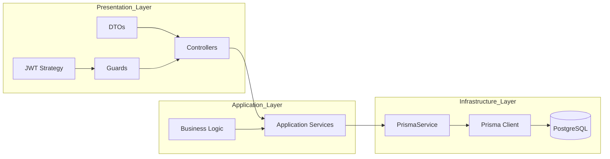

# Task Flow – Documentación Técnica Backend

## 1. Descripción General del Sistema

Task Flow es una plataforma colaborativa para la gestión de tareas que permite a usuarios autenticados:

- Crear sesiones de trabajo
- Administrar tareas
- Asignar colaboradores con distintos roles
- Aplicar control de acceso basado en permisos

El sistema está desarrollado con NestJS, utiliza Prisma ORM y PostgreSQL como base de datos.

## 2. Arquitectura General

El sistema sigue una arquitectura modular por capas alineada con las buenas prácticas de NestJS.

### Capas del sistema

1. **Presentation Layer**
   - Controllers
   - DTOs
   - Guards
   - Strategies

2. **Application Layer**
   - Services
   - Business rules
   - Use case orchestration

3. **Infrastructure Layer**
   - PrismaService
   - Prisma Client
   - PostgreSQL database

---

## 3. Architecture Diagram

## 4. Modelo de Base de Datos

El modelo relacional define las entidades principales del sistema, incluyendo relaciones muchos-a-muchos mediante tablas intermedias.

### Características clave

-   Un usuario puede participar en múltiples sesiones.
-   Una sesión puede tener múltiples usuarios con distintos roles.
-   Una tarea pertenece a una sesión. 
-   Una tarea puede tener subtareas (relación jerárquica).
-   Las asignaciones de tareas se manejan mediante una tabla intermedia.

## 6. Class Diagram – Authentication Module

Este diagrama representa la interacción entre controladores, servicios y capa de infraestructura para el módulo de autenticación y gestión de usuarios.

## 7. Class Diagram – Sessions and Tasks

Este diagrama representa el modelo de negocio relacionado con sesiones colaborativas y gestión de tareas.

## 8. Modelo de Seguridad

### Autenticación

-   JWT (HS256)
-   Expiración de 7 días
-   El payload contiene el identificador del usuario (`sub`)
    
### Seguridad de contraseñas

-   Hash con bcrypt
-   10 salt rounds
    
### Restricciones de base de datos

-   Email único
-   shareCode único
-   Claves compuestas en tablas intermedias
-   Claves foráneas con eliminación en cascada cuando aplica

## 9. Instalación del Proyecto

### Requisitos

-   Node.js 18+
-   PostgreSQL 12+
-   pnpm

### Pasos

1.  Instalar dependencias  
    `pnpm install`
    
2.  Configurar variables de entorno
    
    -   DATABASE_URL
    -   JWT_SECRET
        
3.  Ejecutar migraciones  
    `pnpm prisma migrate dev`
    
4.  Iniciar servidor  
    `pnpm start:dev`
